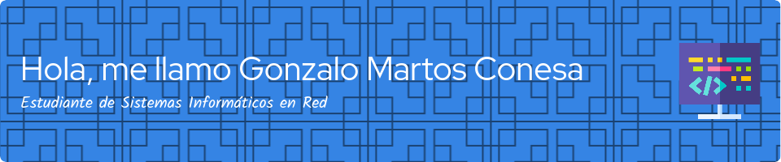

<!--
**GMARTOSMC/GMARTOSMC** is a ✨ _special_ ✨ repository because its `README.md` (this file) appears on your GitHub profile.

Here are some ideas to get you started:

- 🔭 I’m currently working on ...
- 🌱 I’m currently learning ...
- 👯 I’m looking to collaborate on ...
- 🤔 I’m looking for help with ...
- 💬 Ask me about ...
- 📫 How to reach me: ...
- 😄 Pronouns: ...
- ⚡ Fun fact: ...
-->

# Bienvenido a mi Github. Soy Gonzalo Martos 

Actualmente estudio Administración de Sistemas Informáticos en Red en el IES El Bohío. 🙆‍♂️

# Habilidades y tecnologías

En estos dos años he aprendido una interesante cantidad de habilidades y herramientas, en los campos del desarrollo de software, la seguridad informática y la administración de sistemas. A contibuación Pongo mi Stack:

<h2>Mi Stack :man_technologist:</h2>

<table align="center">
  <tr>
    </td>
    <td align="center" width="96">
      
       Python
    </td>
    <td align="center" width="96">
        
       JavaScript
    </td>
    <td align="center" width="96">
        
       C++
    </td>
    <td align="center" width="96">
        
       MySQL
    </td>
    <td align="center" width="96">
        
       C#
    </td>
  </tr>
  <tr>
    <td align="center" width="96">
        
       Github
    </td>
    <td align="center" width="96"> 
        
       Git
    </td>
    <td align="center"  width="96">
        
       HTML5
    </td>
    <td align="center" width="96">
        
       CSS
    </td>
    <td align="center"  width="96">
        
       Bootstrap
    </td>